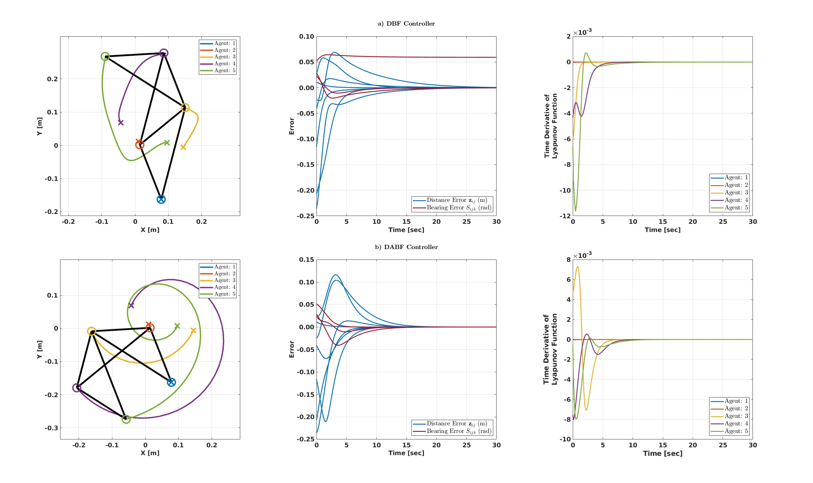

# DABF Shape Formation

## Getting Started

The simulation can be run by running the run_simulation_2D.m file. This file will setup the environment, run both the distance-based formation controller and the distance-aware bearing formation controller, and plot the results as shown in the results section.

The parameters of the simulation can be changed in the `init.m` file.
The main parameters of the simulation include the number of agents, the initial position and the desired position and can be set individually.
1. The number of agents is set using `num_agents` (integer)
2. The initial position is set using `initial_pos` (array \[n x 2])
3. The desired position is set using `desired_pos` (array \[n x 2])

The desired position automatically adjusts to the number of agents. The desired position is a regular polygon that has the same number of sides as the number of agents. 

## Results
Below are the results obtained using this simulation.  

